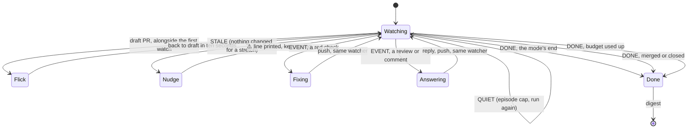

# Watch PR

<!-- token-estimates:start -->

<p>
  
  
</p>

Token estimates use tiktoken's `o200k_base` encoding. `SKILL.md` is the entry prompt; the total adds every
other Markdown file an agent can go on to read. Scripts, assets and config ship with a skill but are run rather
than read, so they are left out.

| File                   | Tokens |
| ---------------------- | -----: |
| [`SKILL.md`](SKILL.md) |  `605` |

<!-- token-estimates:end -->

This manual skill keeps an open pull request moving without repeated status checks. It watches CI, reviews, and comments in the background, fixes clear failures, addresses routine automated feedback,
and asks for input only when a decision needs human judgment. Two siblings narrow it: `watch-pr-ci` (CI only) and `watch-pr-comments` (reviews only).

[Read the canonical skill instructions.](SKILL.md)

## Workflow

The target can be a PR number or URL; without one, the current branch's pull request is used. The Git skill supplies the underlying review, response, disclosure, and safety rules. Its stateful watcher
reports changes instead of replaying the full PR state, and the same watcher state continues after a fix is pushed.

A timed watch runs for the requested duration and defaults to 30 minutes. Pushing a fix restarts the time budget so the new CI run has a full window. Indefinite mode continues through quiet periods
and completed checks, stopping only when the pull request is merged or closed.

## States of a run

Boxes are what the agent is doing; arrow labels are the script's `>>` verdict lines.



| arrow     | watch-pr           | watch-pr-ci | watch-pr-comments       |
| --------- | ------------------ | ----------- | ----------------------- |
| Flick     | yes                | no          | yes                     |
| Fixing    | yes                | yes         | no, CI does not wake it |
| Answering | yes                | no          | yes                     |
| mode end  | green and answered | green       | merge, close, or budget |

## Use

Invoke it directly with a target and optional duration:

```text
/watch-pr 123 1h
/watch-pr https://github.com/owner/repo/pull/123 forever
```

Use `/watch-pr` with no arguments to watch the current branch's pull request for the default duration.
